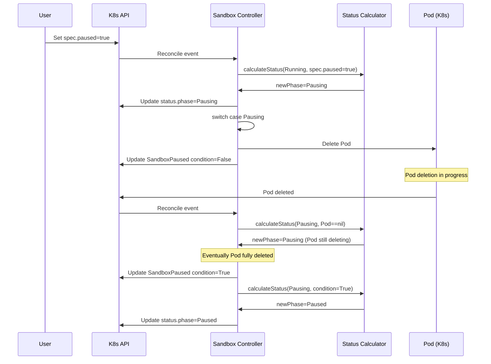

# Design Document: Sandbox Pausing Phase

## Overview

This design introduces a new "Pausing" phase to the Sandbox lifecycle state machine, addressing the current limitation where sandboxes transition directly from "Running" to "Paused" before the underlying Pod deletion completes. The Pausing phase serves as a transitional state that accurately reflects when hibernation is in progress, improving user experience and operational transparency.

The implementation follows the Kubernetes pattern of using phases to represent observable states and conditions to track asynchronous operations. By introducing the Pausing phase, the system will only report a sandbox as "Paused" when hibernation has successfully completed, aligning phase transitions with actual infrastructure state.

## Architecture

### Current State Machine

```
Running (spec.paused=true set by user)
  ↓ [immediate transition]
Paused (Pod deletion may still be in progress)
  ↓ [SandboxPaused condition: False → True asynchronously]
Paused (Pod actually deleted, condition confirms completion)
```

**Problem:** Users see phase="Paused" before hibernation completes, creating confusion about actual state.

### Desired State Machine

```
Running (spec.paused=true set by user)
  ↓ [immediate transition in calculateStatus]
Pausing (SandboxPaused condition: False, Pod deletion initiated)
  ↓ [controller deletes Pod, waits for deletion]
Pausing (Pod deletion in progress)
  ↓ [SandboxPaused condition: False → True when Pod deleted]
Paused (hibernation complete, Pod deleted)
```

**Solution:** Phase accurately reflects operational state - "Pausing" during operation, "Paused" only on completion.

### Component Interaction



## Components and Interfaces

### 1. API Types (`api/v1alpha1/sandbox_types.go`)

**Changes Required:**
- Add new phase constant `SandboxPausing` to the `SandboxPhase` type
- Update phase documentation

**New Constant:**
```go
const (
    // ... existing phases ...
    
    // SandboxPausing means the sandbox is transitioning to paused state.
    // Pod deletion is in progress but not yet complete.
    SandboxPausing SandboxPhase = "Pausing"
    
    // ... existing phases ...
)
```

**Interface Contract:**
- The new phase is purely additive - no changes to existing phase values
- Backwards compatible for clients that don't recognize the new phase

### 2. Controller State Machine (`pkg/controller/sandbox/sandbox_controller.go`)

**Function: `calculateStatus()`**

This function determines the next phase based on current state and desired state. Changes needed:

```go
case agentsv1alpha1.SandboxRunning:
    // Existing checks for pod nil/deleted, pod completed
    // ...
    
    // NEW: Transition to Pausing when pause requested
    if box.Spec.Paused {
        utils.RemoveSandboxCondition(newStatus, string(agentsv1alpha1.SandboxConditionResumed))
        newStatus.Phase = agentsv1alpha1.SandboxPausing  // Changed from SandboxPaused
        // Set initial pause condition
        pauseCond := metav1.Condition{
            Type:               string(agentsv1alpha1.SandboxConditionPaused),
            Status:             metav1.ConditionFalse,
            Reason:             agentsv1alpha1.SandboxPausedReasonSetPause,
            LastTransitionTime: metav1.Now(),
        }
        utils.SetSandboxCondition(newStatus, pauseCond)
    }
    // ... upgrade check ...

// NEW CASE: Handle Pausing phase
case agentsv1alpha1.SandboxPausing:
    pauseCond := utils.GetSandboxCondition(newStatus, string(agentsv1alpha1.SandboxConditionPaused))
    // Transition to Paused only when condition confirms completion
    if pauseCond != nil && pauseCond.Status == metav1.ConditionTrue {
        newStatus.Phase = agentsv1alpha1.SandboxPaused
    }
    // Handle user canceling pause before completion
    if !box.Spec.Paused && pauseCond != nil && pauseCond.Status == metav1.ConditionFalse {
        // User unpaused before pause completed, transition back to Running
        utils.RemoveSandboxCondition(newStatus, string(agentsv1alpha1.SandboxConditionPaused))
        newStatus.Phase = agentsv1alpha1.SandboxRunning
    }
```

**Function: `Reconcile()`**

Add case handler for the Pausing phase in the switch statement:

```go
switch newStatus.Phase {
case agentsv1alpha1.SandboxPending:
    requeueAfter, err = r.getControl(args.Pod).EnsureSandboxRunning(ctx, args)
case agentsv1alpha1.SandboxRunning:
    err = r.getControl(args.Pod).EnsureSandboxUpdated(ctx, args)
    
// NEW CASE
case agentsv1alpha1.SandboxPausing:
    err = r.EnsureSandboxPaused(ctx, args)
    
case agentsv1alpha1.SandboxPaused:
    err = r.EnsureSandboxPaused(ctx, args)
case agentsv1alpha1.SandboxResuming:
    err = r.getControl(args.Pod).EnsureSandboxResumed(ctx, args)
// ...
}
```

**Interface Contract:**
- `calculateStatus()` must transition Running → Pausing on spec.paused=true
- `calculateStatus()` must transition Pausing → Paused only when SandboxPaused condition is True
- Reconcile loop must invoke pause handler for Pausing phase
- Error handling must be consistent with other phases

### 3. Metrics (`pkg/controller/sandbox/metrics.go`)

**Changes Required:**

Add `SandboxPausing` to the `allPhases` array:

```go
var allPhases = []agentsv1alpha1.SandboxPhase{
    agentsv1alpha1.SandboxPending,
    agentsv1alpha1.SandboxRunning,
    agentsv1alpha1.SandboxPausing,     // NEW
    agentsv1alpha1.SandboxPaused,
    agentsv1alpha1.SandboxResuming,
    agentsv1alpha1.SandboxUpgrading,   // NEW (if not already present)
    agentsv1alpha1.SandboxSucceeded,
    agentsv1alpha1.SandboxFailed,
    agentsv1alpha1.SandboxTerminating,
}
```

**Function: `recordSandboxMetrics()`**

No changes needed - the existing logic automatically handles the new phase:
- `sandbox_status_phase{phase="Pausing"}` will be emitted when phase=Pausing
- Metric cleanup logic will automatically clean up stale Pausing phase metrics
- Duration metrics (pause_duration_seconds) are condition-based, not phase-based

**Interface Contract:**
- Metrics must emit `sandbox_status_phase{phase="Pausing"}=1` when in Pausing phase
- Metrics must delete stale Pausing phase series when transitioning out
- Pause duration histogram must continue to work correctly (condition-based, unaffected by phase change)

### 4. Rate Limiter (`pkg/controller/sandbox/core/rateLimiter.go`)

**Function: `isCreatingSandbox()`**

Add Pausing to the list of non-creating phases:

```go
func isCreatingSandbox(box *agentsv1alpha1.Sandbox) bool {
    if !box.DeletionTimestamp.IsZero() {
        return false
    }
    // Non-creating phases
    if box.Status.Phase == agentsv1alpha1.SandboxPausing ||  // NEW
       box.Status.Phase == agentsv1alpha1.SandboxPaused ||
       box.Status.Phase == agentsv1alpha1.SandboxResuming ||
       box.Status.Phase == agentsv1alpha1.SandboxSucceeded ||
       box.Status.Phase == agentsv1alpha1.SandboxFailed {
        return false
    }
    // Running with Ready=True is not creating
    cond := utils.GetSandboxCondition(&box.Status, string(agentsv1alpha1.SandboxConditionReady))
    if box.Status.Phase == agentsv1alpha1.SandboxRunning && cond != nil && cond.Status == metav1.ConditionTrue {
        return false
    }
    return true
}
```

**Rationale:** A sandbox in Pausing phase is shutting down its Pod, not creating one. It should not block high-priority sandbox creation.

**Interface Contract:**
- `isCreatingSandbox()` must return false for Pausing phase
- Rate limiter must decrement creating count when transitioning to Pausing
- High-priority sandbox creation must not be blocked by Pausing sandboxes

## Data Models

### Phase Enumeration

```go
type SandboxPhase string

const (
    SandboxPending     SandboxPhase = "Pending"
    SandboxRunning     SandboxPhase = "Running"
    SandboxPausing     SandboxPhase = "Pausing"     // NEW
    SandboxPaused      SandboxPhase = "Paused"
    SandboxResuming    SandboxPhase = "Resuming"
    SandboxUpgrading   SandboxPhase = "Upgrading"
    SandboxSucceeded   SandboxPhase = "Succeeded"
    SandboxFailed      SandboxPhase = "Failed"
    SandboxTerminating SandboxPhase = "Terminating"
)
```

### Condition Transitions

**SandboxPaused Condition Lifecycle:**

1. **Running → Pausing**: Condition set to False with reason SetPause
2. **Pausing (in progress)**: Condition remains False with reason DeletePod
3. **Pausing → Paused**: Condition set to True when Pod deleted

The condition status (False/True) determines when phase transition occurs.

### State Transition Table

| Current Phase | Spec.Paused | Pod State | SandboxPaused Condition | Next Phase | Action |
|--------------|-------------|-----------|------------------------|------------|--------|
| Running | true | Running | - | Pausing | Set condition=False, transition phase |
| Pausing | true | Running | False | Pausing | Continue Pod deletion |
| Pausing | true | Deleting | False | Pausing | Wait for deletion |
| Pausing | true | nil | True | Paused | Transition complete |
| Pausing | false | any | False | Running | User canceled, abort pause |
| Paused | false | nil | True | Resuming | Start resume |

## Correctness Properties

*A property is a characteristic or behavior that should hold true across all valid executions of a system—essentially, a formal statement about what the system should do. Properties serve as the bridge between human-readable specifications and machine-verifiable correctness guarantees.*

### Property Reflection

After analyzing all acceptance criteria, several properties were identified as candidates. Through reflection, the following redundancies were found:

- Properties 3.4 and 3.5 (pause duration and total metrics) can be combined into a single comprehensive property about pause metrics continuing to work
- Properties 4.1 and 4.2 (rate limiter treating Pausing as non-creating and decrementing count) are logically connected and can be combined
- Property 6.3 (status update after processing) is redundant with the general controller behavior and doesn't need separate testing

The refined properties focus on unique validation value without overlap.

### Properties

Property 1: Running to Pausing transition
*For any* Sandbox in Running phase, when spec.paused is set to true, the phase SHALL transition to Pausing (not directly to Paused)
**Validates: Requirements 2.1, 2.5**

Property 2: Pausing phase stability during operation
*For any* Sandbox in Pausing phase, while the SandboxPaused condition status is False, the phase SHALL remain Pausing
**Validates: Requirements 2.2**

Property 3: Pausing to Paused completion transition
*For any* Sandbox in Pausing phase, when the SandboxPaused condition status transitions to True, the phase SHALL transition to Paused
**Validates: Requirements 2.3**

Property 4: Pausing phase metrics
*For any* Sandbox in Pausing phase, the metric `sandbox_status_phase{phase="Pausing"}` SHALL be emitted with value 1, and when exiting Pausing phase, the metric series SHALL be deleted
**Validates: Requirements 3.2, 3.3**

Property 5: Pause metrics continuation
*For any* pause operation, the `sandbox_pause_duration_seconds` histogram and `sandbox_pause_total` counter SHALL continue to be updated correctly regardless of the Pausing phase introduction
**Validates: Requirements 3.4, 3.5**

Property 6: Rate limiter non-creating treatment
*For any* Sandbox in Pausing phase, the rate limiter SHALL treat it as non-creating (isCreatingSandbox returns false) and SHALL NOT block high-priority sandbox creation
**Validates: Requirements 4.1, 4.2, 4.3**

Property 7: Pause-resume round trip
*For any* Sandbox that completes a Pausing→Paused transition, when spec.paused is subsequently set to false, the Sandbox SHALL resume normally with proper SandboxResumed condition handling
**Validates: Requirements 5.1, 5.2**

Property 8: Error surfacing
*For any* Sandbox in Pausing phase that encounters an error during the pause operation, the error SHALL be surfaced in the status conditions appropriately
**Validates: Requirements 6.4**


## Error Handling

### Pause Operation Errors

**Scenario:** Pod deletion fails during Pausing phase

**Handling:**
- Controller will retry on next reconciliation
- SandboxPaused condition remains False with updated reason/message
- Phase remains Pausing until condition becomes True or user cancels
- Errors logged with structured logging: `klog.ErrorS(err, "failed to delete pod during pause", "sandbox", klog.KObj(box))`

### User Cancellation During Pause

**Scenario:** User sets spec.paused=false while in Pausing phase (before completion)

**Handling:**
- Controller detects `!box.Spec.Paused` in calculateStatus during Pausing phase
- If SandboxPaused condition is still False (pause not complete), transition back to Running
- Remove SandboxPaused condition
- Pod may need to be recreated if already deleted
- This is gracefully handled by the existing resume logic

### Invalid State Transitions

**Scenario:** Sandbox in unexpected state (e.g., Pausing with no SandboxPaused condition)

**Handling:**
- Controller logs warning and initializes condition if missing
- Uses defensive programming: `pauseCond := utils.GetSandboxCondition(...)` with nil checks
- Metrics will flag abnormal states via `sandbox_status_abnormal` metric

### Informer Cache Delays

**Scenario:** Pod deletion completes but informer cache hasn't updated yet

**Handling:**
- Use existing Expectations mechanism in `pkg/utils/expectations/`
- ResourceVersionExpectations already handles this for status updates
- ScaleExpectations handles Pod create/delete events
- Controller will be re-queued when cache catches up

## Testing Strategy

### Unit Tests

Unit tests will focus on specific examples and edge cases that demonstrate correct behavior:

**Test File:** `pkg/controller/sandbox/sandbox_controller_test.go`

1. **State Transition Tests:**
   - Running→Pausing when spec.paused=true
   - Pausing→Paused when condition=True
   - Pausing→Running when user cancels (spec.paused=false)
   - Ensure direct Running→Paused transition doesn't occur

2. **Edge Case Tests:**
   - User cancels pause during Pausing phase (before Pod deleted)
   - Pod already deleted before Pausing phase entered
   - Missing SandboxPaused condition during Pausing phase
   - Multiple rapid pause/unpause toggles

**Test File:** `pkg/controller/sandbox/metrics_test.go`

1. **Metric Emission Tests:**
   - Verify Pausing phase metric emission
   - Verify metric cleanup when exiting Pausing
   - Verify pause duration histogram continues to work
   - Verify pause counter continues to work

**Test File:** `pkg/controller/sandbox/core/rateLimiter_test.go`

1. **Rate Limiter Tests:**
   - Verify isCreatingSandbox returns false for Pausing phase
   - Verify high-priority creation not blocked by Pausing sandboxes
   - Verify rate limiter track updated when entering Pausing

### Property-Based Tests

Property-based tests will validate universal properties across randomized inputs using [Ginkgo](https://onsi.github.io/ginkgo/) (the project's E2E testing framework). Each property test will run a minimum of 100 iterations.

**Configuration:**
- Testing framework: Ginkgo (already used in the project)
- Minimum iterations: 100 per property
- Tag format: `// Feature: sandbox-pausing-phase, Property N: <property_text>`

**Test File:** `pkg/controller/sandbox/pause_properties_test.go` (new file)

Each correctness property will be implemented as a separate Ginkgo test:

```go
// Feature: sandbox-pausing-phase, Property 1: Running to Pausing transition
var _ = Describe("Property: Running to Pausing transition", func() {
    It("should transition Running to Pausing when spec.paused=true", func() {
        // Run 100 iterations with randomized sandbox configurations
        for i := 0; i < 100; i++ {
            // Generate random sandbox in Running phase
            // Set spec.paused=true
            // Call calculateStatus
            // Assert phase transitioned to Pausing (not Paused)
        }
    })
})
```

**Property Test Specifications:**

1. **Property 1:** Running to Pausing transition
   - Generate random sandboxes in Running phase (varied templates, resources, labels)
   - Set spec.paused=true
   - Verify phase becomes Pausing, not Paused

2. **Property 2:** Pausing phase stability
   - Generate random sandboxes in Pausing with condition=False
   - Call calculateStatus repeatedly
   - Verify phase remains Pausing

3. **Property 3:** Pausing to Paused completion
   - Generate random sandboxes in Pausing
   - Set SandboxPaused condition to True
   - Verify phase transitions to Paused

4. **Property 4:** Pausing phase metrics
   - Generate random sandboxes entering/exiting Pausing
   - Verify metric emission and cleanup

5. **Property 5:** Pause metrics continuation
   - Generate random pause operations with Pausing phase
   - Verify histogram and counter metrics updated correctly

6. **Property 6:** Rate limiter non-creating treatment
   - Generate random sandboxes in Pausing phase (high/normal priority)
   - Verify isCreatingSandbox returns false
   - Verify high-priority creation not blocked

7. **Property 7:** Pause-resume round trip
   - Generate random sandboxes
   - Pause (→Pausing→Paused)
   - Resume
   - Verify proper condition handling and successful resume

8. **Property 8:** Error surfacing
   - Generate random pause errors
   - Verify errors appear in conditions with proper reasons/messages

### Integration Tests

**Test File:** `test/e2e/sandbox/pause_test.go`

End-to-end integration tests will verify the complete pause workflow in a real Kubernetes cluster:

1. **Full Pause Cycle Test:**
   - Create sandbox, wait for Running
   - Set spec.paused=true
   - Verify phase transitions: Running→Pausing→Paused
   - Verify Pod is deleted
   - Verify SandboxPaused condition reflects each stage

2. **Pause Cancellation Test:**
   - Create sandbox, wait for Running  
   - Set spec.paused=true (enters Pausing)
   - Before pause completes, set spec.paused=false
   - Verify graceful return to Running

3. **Metrics Verification Test:**
   - Create sandbox, pause it
   - Query Prometheus metrics endpoint
   - Verify Pausing phase metrics emitted correctly
   - Verify pause duration recorded

### Test Coverage Goals

- Unit test coverage: ≥80% for modified files
- Property tests: 100 iterations minimum per property
- Integration tests: Cover all happy path and major error scenarios
- Focus on state machine correctness and backward compatibility

### Testing Notes

Following the project's multi-agent development guidelines:
- Unit tests will be scoped to modified packages only (not `go test ./pkg/...`)
- Property tests will use Ginkgo's randomization features
- Integration tests will use existing E2E test infrastructure
- Tests must follow table-driven format where applicable
- Use `expectError string` pattern for error test cases
